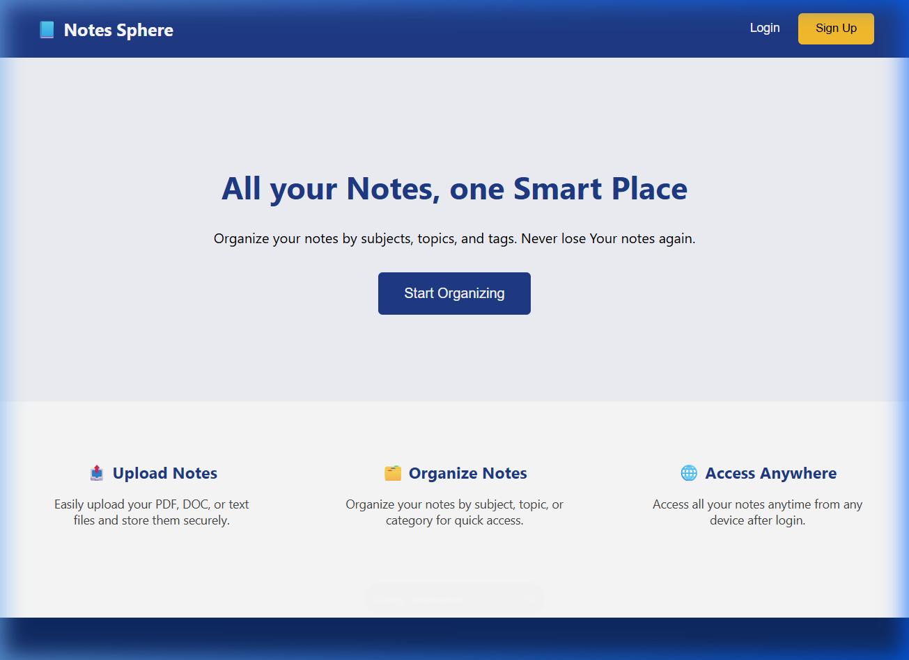
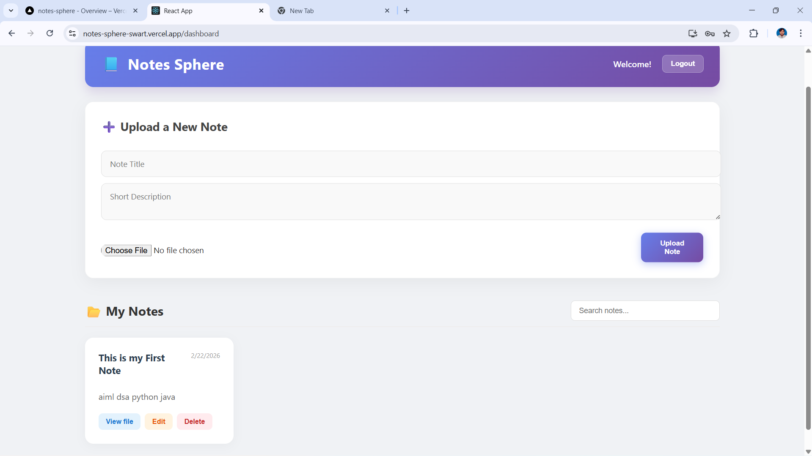
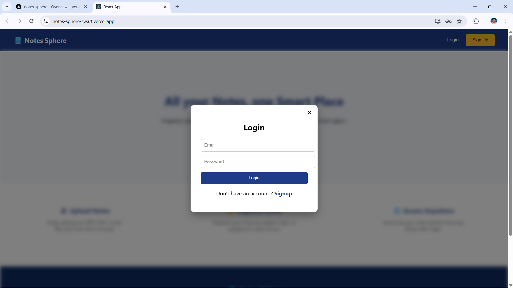
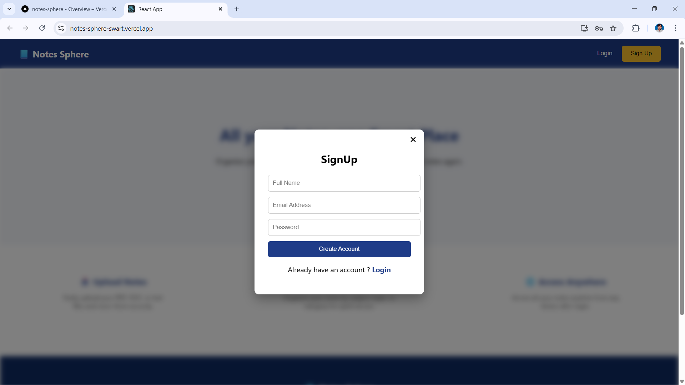

# 📔 Notes Sphere

**Notes Sphere** is a production-ready, full-stack digital note management platform built with the **MERN stack**. It lets students and professionals upload, organize, and access study materials from anywhere — with enterprise-grade security, cloud storage, and CI/CD automation.

🚀 **Live Demo:** [https://notes-sphere-swart.vercel.app/](https://notes-sphere-swart.vercel.app/)
🐳 **Docker Hub:** `ankur5529/notes-sphere:latest`

> **Try it now without signing up!** Click the **"Continue as Guest"** button on the login screen to explore the full dashboard instantly.

---

## 📸 Preview

### Landing Page


### User Dashboard


### Authentication (with Guest Login)
| Login | Sign Up |
|-------|---------|
|  |  |

---

## ✨ Features

| Feature | Description |
|---|---|
| 👤 **Guest Login** | Explore the full dashboard instantly — no sign-up required. One click, zero friction. |
| ☁️ **Cloud Storage** | All files natively stored inside MongoDB using **GridFS Bucket**, keeping the app 100% stateless and deployable anywhere. |
| 📤 **Secure Note Upload** | Upload PDF, DOC, and image files with strict type-validation (5MB limit). |
| 📁 **Smart Organization** | Categorize notes by title and description; search across all your content in real-time. |
| 🌐 **Anywhere Access** | Your notes are available on any device, any time. |
| 🔐 **JWT Authentication** | Secure signup/login with JWT tokens and Bcrypt password hashing. |
| ✅ **Input Validation** | Server-side validation via `express-validator` on all auth and note endpoints. |
| 🛡️ **Security Hardened** | `helmet`, custom Express 5-compatible NoSQL sanitizer, and route-specific `express-rate-limit` protect against XSS, injection, and brute-force attacks. |
| ⚡ **Skeleton Loading** | Premium shimmer skeleton cards appear while notes are fetching — no blank screens. |
| ♿ **Fully Accessible** | WCAG-compliant ARIA labels, `role` attributes, keyboard-navigable UI, `focus-visible` styles, and screen-reader announcements. |
| 🐳 **Docker Ready** | Multi-stage `Dockerfile` + `docker-compose.yml` for consistent deployment anywhere. |
| 🔄 **CI/CD Pipeline** | GitHub Actions automatically lints, tests, builds, and pushes a Docker image on every push to `main`. |
| 💬 **Toast Notifications** | Non-intrusive success/error messages that fade away automatically. |

---

## 🛠️ Tech Stack

### Frontend
- **React 19** — Dynamic and responsive UI
- **React Router 7** — Client-side routing
- **CSS** — Custom styling with shimmer animations and glassmorphism

### Backend
- **Node.js & Express 5** — Robust server-side logic
- **MongoDB & Mongoose** — Scalable NoSQL database
- **JWT** — Secure authentication and session management
- **Multer + GridFS** — Memory-streamed file upload to MongoDB natively
- **BcryptJS** — Industry-standard password hashing

### DevOps & Security
- **Docker** — Multi-stage containerization
- **GitHub Actions** — CI/CD pipeline (test → build → push)
- **Helmet** — HTTP security headers
- **express-rate-limit** — Brute-force protection
- **Custom Sanitizer** — NoSQL injection prevention optimized for Express 5
- **express-validator** — Request body validation

---

## 🚀 Getting Started

### Prerequisites
- Node.js v20+
- MongoDB Atlas account
- MongoDB Atlas account (with Network Access unblocked)
- npm or yarn

### Installation

1. **Clone the repository:**
   ```bash
   git clone https://github.com/Ankur5529/Notes_Sphere_Mern.git
   cd Notes_Sphere_Mern
   ```

2. **Setup the Server:**
   ```bash
   cd server
   npm install
   ```
   Create a `.env` file in the `server/` directory:
   ```env
   PORT=5000
   # MongoDB Atlas Connection String
   MONGO_URI=your_mongodb_connection_string

   # Guest account (auto-created on first guest login)
   GUEST_EMAIL=guest@notessphere.demo
   GUEST_PASSWORD=GuestDemo@123
   ```
   Start the server:
   ```bash
   npm run dev
   ```

3. **Setup the Client:**
   ```bash
   cd ../client
   npm install
   npm start
   ```

### 🐳 Run with Docker

```bash
# Production (single command)
docker compose up --build

# Development (with hot-reload frontend)
docker compose --profile dev up --build
```

---

## 📂 Project Structure

```text
Notes_Sphere_Mern/
├── .github/
│   └── workflows/
│       └── ci-cd.yml         # GitHub Actions CI/CD pipeline
├── client/                    # React frontend
│   ├── src/
│   │   ├── Components/
│   │   │   ├── Dashboard.js   # Main dashboard with skeleton loaders
│   │   │   ├── Login.js       # Login modal with Guest Login button
│   │   │   ├── SkeletonCard.js # Accessible shimmer skeleton component
│   │   │   └── ...
│   │   └── config.js          # API base URL config
│   └── Dockerfile.dev         # Dev Docker image for client
├── server/                    # Express backend
│   ├── config/
│   │   └── upload.js          # Multer memory-storage configuration
│   ├── middleware/
│   │   └── auth.middleware.js # JWT verification middleware
│   ├── models/
│   │   ├── User.js            # User schema
│   │   └── Note.js            # Note schema (with cloudinaryPublicId)
│   ├── routes/
│   │   ├── auth.routes.js     # Auth routes (signup, login, guest-login)
│   │   └── notes.routes.js    # Notes CRUD with GridFS upload and streaming
│   └── server.js              # Express app entry point
├── Dockerfile                 # Multi-stage production Dockerfile
├── docker-compose.yml         # Docker Compose orchestration
└── images/                    # Project screenshots
```

---

## 🔒 Security Features In-Depth

| Layer | Implementation |
|---|---|
| **Rate Limiting** | Global: 100 req/15min. Auth routes: 5 req/15min to prevent brute-force. |
| **Input Validation** | `express-validator` on all POST/PUT endpoints (email format, min password length). |
| **NoSQL Sanitization** | Custom middleware strips `$` and `.` from user input (Express 5 compatible). |
| **Security Headers** | `helmet` sets `X-Content-Type-Options`, `X-Frame-Options`, `HSTS`, and more. |
| **File Security** | MIME type whitelist + 5MB file size limit enforced at the middleware level. |
| **Password Hashing** | bcrypt with 10 salt rounds. |
| **JWT Expiry** | Access tokens expire in 2 days (guest tokens: 4 hours). |

---

## 🔄 CI/CD Pipeline

The GitHub Actions workflow at `.github/workflows/ci-cd.yml` runs on every push to `main`:

```
Push to main
     │
     ├─▶ [Job 1] Backend CI  ──── npm test
     ├─▶ [Job 2] Frontend CI ──── npm run build
     │
     └─▶ [Job 3] Docker Build & Push (only if Jobs 1 & 2 pass)
                 └─▶ docker/build-push-action → Docker Hub
```

---

## 🧠 Challenges & Solutions

| Challenge | Solution |
|---|---|
| **Stateless file storage** | Moved from local disk to **MongoDB GridFS**, streaming files through memory to the cloud without touching the filesystem. |
| **Blank loading state** | Implemented shimmer Skeleton Cards to maintain layout during fetch, preventing jarring content shifts. |
| **Recruiter UX barrier** | Added a one-click Guest Login so anyone can instantly explore the app without signing up. |
| **Brute-force vulnerability** | Applied `express-rate-limit` specifically to auth routes (5 requests / 15 min) while keeping the global limit more lenient (100 req / 15 min). |
| **Accessibility gaps** | Audited every interactive element — added ARIA roles, `aria-live` regions, visible focus outlines, and `<label>` associations for all form inputs. |

---

## 🤝 Contributing

Contributions are welcome! Feel free to open an issue or submit a pull request.

1. Fork the Project
2. Create your Feature Branch (`git checkout -b feature/AmazingFeature`)
3. Commit your Changes (`git commit -m 'Add some AmazingFeature'`)
4. Push to the Branch (`git push origin feature/AmazingFeature`)
5. Open a Pull Request

---

## 📄 License

Distributed under the ISC License.

---

**Developed with ❤️ by [Ankur](https://github.com/Ankur5529)**
